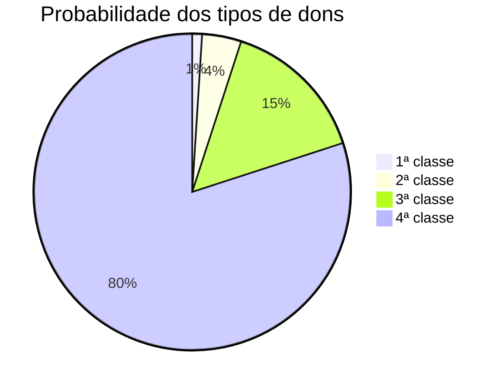

Além das [[Magias]] que conhecemos, os seres vivos possuem capacidades inatas que são concedidas ao seu nascimento, seja por sua linhagem ou raça. Por exemplo, habilidades de [[Conjuração e invocação]].

# **Dons**
Alguns indivíduos, quando são concebidos no [[mundus]], recebem habilidades elementais e não-elementais únicas. Concebidos pelo [[Old Laguna]], esses dons são dados a toda e qualquer criatura viva. No entanto, são bastante raros de serem concebidos, e quando o indivíduo recebe essa benção, pode ter a probabilidade de ser algo não tão útil. (Algumas raças possuem dons para todos.)

Apenas a cada 100 indivíduos, 1 deles possui dons, e em raros casos o indivíduo possui mais de um dom. 

Os dons são divididos por classe. Ao nascimento de um indivíduo com dom, ele possui um símbolo em suas mãos para cada tipo de classe de dom.
## **Dons de quarta classe**
![[Pasted image 20240206150817.png|cover Lsmall]]
Os dons de 4ª classe são aqueles que concedem capacidades para afazeres do dia a dia e melhoramento da qualidade de vida. Essa classe é a que tem mais diversidade de dons.

**Dom da diferenciação:** Esse dom concede ao seu usuário a capacidade de diferenciar o sal do açúcar e as frutas venenosas das comestíveis. Ser um objeto e verdadeiro ou não.

**Dom de Liriys:** Com esse dom, o indivíduo pode sentir e compreender as emoções dos outros, sentindo a dor de seus corações.

**Dom da cura menor:** Permite ao usuário curar pequenos ferimentos, em si mesmo ou em outros.

**Dom da persuasão:** Concede ao indivíduo a habilidade de convencer e persuadir outras pessoas com facilidade.

**Dom da empatia animal:** Permite ao usuário se conectar emocionalmente com animais, entendendo suas necessidades e se comunicando com eles de forma intuitiva.

**Dom da tradução instantânea:** Permite ao usuário compreender e falar qualquer idioma instantaneamente.
## **Dons de terceira classe**
![[Pasted image 20240206170847.png|cover Lsmall]]
Os dons de 3ª classe são aqueles que concedem habilidades variadas de aprimoramento físico e mental.

**Dom dos espíritos do vento:** Permite ao usuário possuir uma agilidade superior, sendo leve como o vento.

**Dom dos espíritos da terra:** Concede ao usuário uma força superior e uma resistência maior a danos.

**Dom da memória:** Permite ao usuário memorizar e lembrar com precisão qualquer informação que tenha recebido.

**Dom do sábio:** Concede ao usuário a capacidade de aprender e adquirir conhecimento de forma mais rápida.
## **Dons de segunda classe**
![[Pasted image 20240206175025.png]]
Os dons de 2ª classe são todos focados em elementos de combate. Aqueles que são concedidos com esse dom são chamados de feiticeiros ([[Feitiçaria]]). Diferente das outras classes que possuem milhares de dons, os de 2ª classe possuem apenas 5 dons.

**Dom dos elementos:** Um dos dons mais raros, o usuário possui total poder sobre os 4 elementos, podendo conjurar e invocar de forma tão simples como respirar.

**Dons dos 4 elementos:** Os indivíduos nascem com habilidade inata de conjurar e invocar um dos 4 elementos. Os usuários nascidos com esse dom poderão controlar com maestria 1 dos 4 elementos.

## **Dons de primeira classe**
![[Pasted image 20240206175056.png]]
Os dons de 1ª classe são habilidades únicas. Diferente das outras classes, os dons de primeira classe são altamente aleatórios, porém dão ao usuário um poder extraordinário.

# **Magia de linhagem e racial**
As magias de linhagem e racial são características únicas de cada espécie e raça.